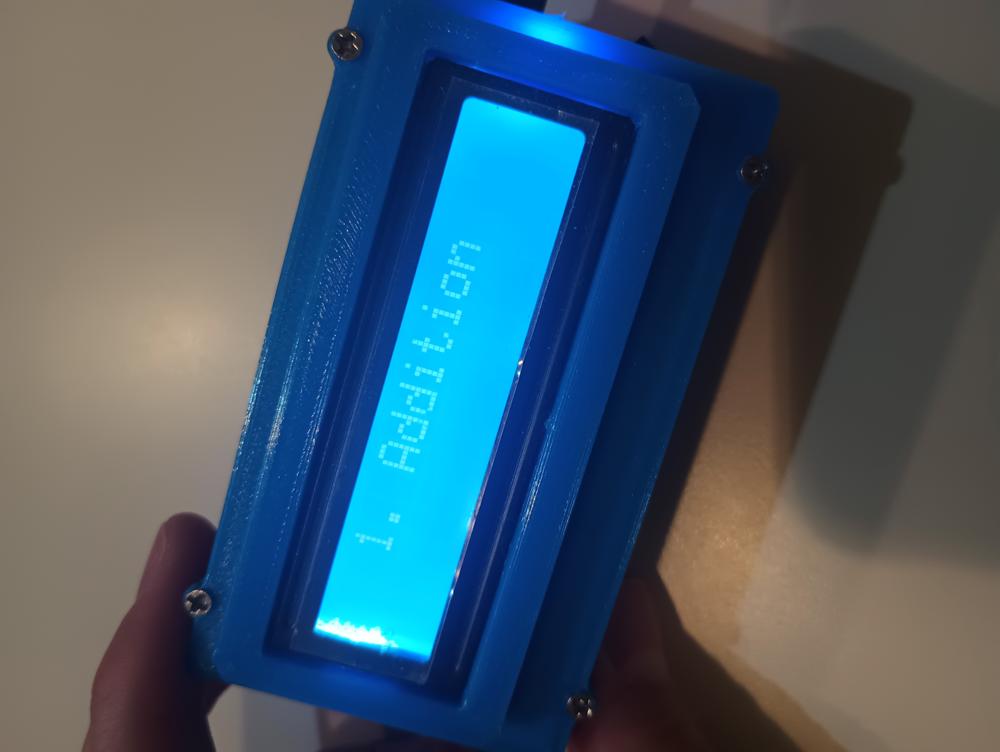

# Problem Maker

**Problem Maker** is a handheld hardware device designed to help you practice math in a focused, distraction-free way.  
Using a **rotary encoder**, you select the math operation you want to practice, then solve **10 generated problems** while the device **tracks your time**.

---

## ✨ Features

- 🔄 Rotary encoder to select math symbols (➕ ➖ ✖ ➗)
- 🧮 Generates 10 math problems per session
- ⏱ Built-in timer to measure completion time
- 📟 Display shows questions, answers, and time
- 📦 Handheld enclosure — simple and tactile
- 🎯 Designed for speed practice and embedded learning

---

## 🕹 How It Works

1. Turn the **rotary encoder** to choose a math operation.
2. Press **Start** to begin a session.
3. Solve **10 math questions** generated by the device.
4. The timer runs until all problems are completed.
5. Your total time is displayed at the end.
6. Reset and try to beat your best time.

---

## 🔌 Schematic

### High-Level Block Diagram

